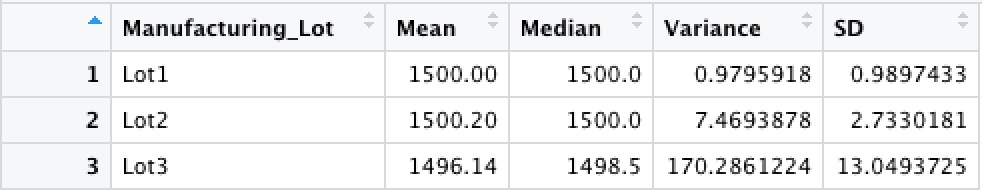

# MechaCar Statistical Analysis
Using R and RStudio, I have reviewed production data of a car company's prototype, MechaCar, to help the manufacturing team's progress.

## Linear Regression to Predict MPG
- Vehicle length and ground clearance are the variables that provide a stastically significant, non-random amount of variance to the mpg values in the dataset.
- Since the p-value of the linear model is 5.35e-11, much smaller compared to our assumed significance level of 0.05, there is sufficient evidence to reject our null hypothesis, and the slope is not zero.
- The linear model effectively predicts the mpg of the MechaCar proptotypes. The r-squared value is 0.7149, which means that roughly 71% of the variability of the mpg is explained using this model. 

## Summary Statistics on Suspension Coils

- The design specifications for the MechaCar suspension coils dictate that the variance of the suspension coils must not exceed 100 pounds per square inch. The current manufacturing data meets this design specification when observing all manufacturing lots in total as the variance is at 62.29. 

- However, upon evaluation of the variance per each manufacturing lot, Lot 3 shows a variance of 170.29. Lot 3 does not meet this design specification.

## T-Tests on Suspension Coils

Using your knowledge of R, perform t-tests to determine if all manufacturing lots and each lot individually are statistically different from the population mean of 1,500 pounds per square inch.

#### T-test results of all manufacturing lots:
The p-value is 0.06 which is higher than our significance level of 0.05 indicating there is not enough evidence to reject the null hypothesis. The mean of all manufacturing lots is statistically similar to the population mean of 1500 PSI. 

#### T-test results of Lot 1:
With a sample mean of 1500 and a p-value of 1, there is no statistical difference between the sample of Lot 1 and the population mean of 1500. 

#### T-test results of Lot 2:
With a sample mean of 1500.2 and a p-value of 0.61, we cannot reject the null hypothesis. There is little statistical difference between the sample of Lot 2 and the population mean of 1500.

#### T-test results of Lot 3:
With a sample mean of 1496.14 and a p-value of 0.4, lower than our significance level of 0.05, we can reject the null hypothesis. The sample of Lot 3 and the population mean of 1500 are statically different. 

## Study Design: MechaCar vs Competition

1. What metrics are you going to test? 

2. What is the null hypothesis? What is the alt hypothesis?

3. What statistical test will you use to test the hypothesis and why?

4. What data is needed to run the statistical test?